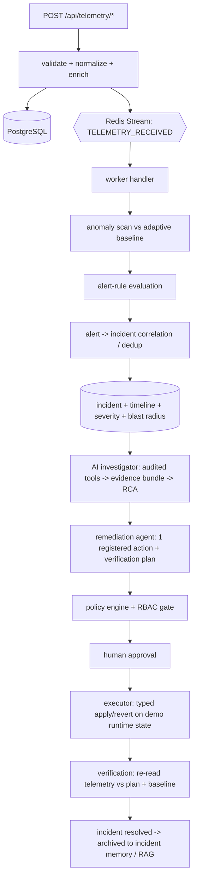

# Architecture

## Components

| Process | Responsibility | Hard deps |
|---|---|---|
| **api** (`nirikshan.api.app`) | HTTP API, auth/RBAC, telemetry ingestion, all read paths, triggers investigations/remediation synchronously on request | PostgreSQL |
| **worker** (`nirikshan.workers.runner`) | Consumes the Redis event stream; runs the telemetry→incident→investigation→remediation pipeline for *pushed* telemetry; periodic health refresh + retention | PostgreSQL (Redis for events) |
| **web** (`apps/web`) | Next.js dashboard; polls the API and subscribes to `/api/stream` (SSE) | api |
| **postgres** | Authoritative store — 28 tables | — |
| **redis** | Event streams, SSE pub/sub, cache, rate-limit counters | — |

The API and worker share the same code (`src/nirikshan`). In Compose they are
the same image with a different command.

## Data flow

The API can also run the same `incident → investigate → propose → approve →
execute → verify` chain synchronously (used by the UI action buttons and the
demo flow). The worker path is what makes *pushed* telemetry from real
applications turn into incidents without a UI action.

## Why PostgreSQL is authoritative and Redis is not

Every incident/remediation state change happens inside one SQL transaction.
Events on the Redis stream are **derived signals** — losing them means the
worker doesn't react to a telemetry push, but no incident data is lost and the
API's synchronous paths still work. A circuit breaker (`core/redis_bus.py`)
prevents a dead Redis from adding its socket timeout to every request.

## Event catalogue

`TELEMETRY_RECEIVED`, `ANOMALY_DETECTED`, `ALERT_CREATED`, `ALERT_RESOLVED`,
`INCIDENT_CREATED`, `INCIDENT_UPDATED`, `INVESTIGATION_{STARTED,COMPLETED,FAILED}`,
`REMEDIATION_{PROPOSED,APPROVED,REJECTED,STARTED,COMPLETED,FAILED,ROLLED_BACK}`,
`DEPLOYMENT_RECORDED`. Each is appended to `nirikshan:events` (Streams, capped
via `MAXLEN ~`) and mirrored to `nirikshan:live` (pub/sub) for SSE.

## Observability of the platform itself

`GET /api/health` (component status), `GET /api/metrics` (Prometheus-style
exposition of open incidents / firing alerts / anomalies / failed agent runs),
`GET /api/agents/ops/summary` (AI cost/latency/tool-call rollup), structured
JSON logs, `x-request-id` on every response.
