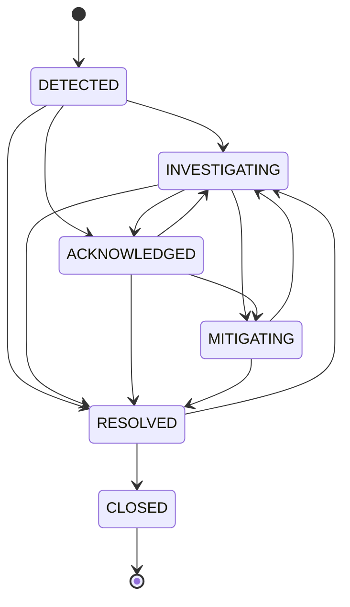
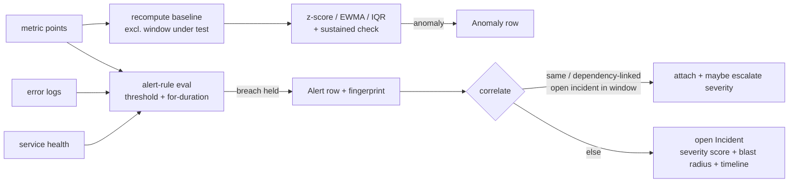

# Incident Lifecycle

## State machine

Transitions are enforced by `INCIDENT_TRANSITIONS` in `domain/enums.py`;
`incidents.engine.transition()` raises `StateTransitionError` on an illegal move
and stamps `acknowledged_at` / `mitigated_at` / `resolved_at` / `closed_at`.

## From telemetry to incident

## Deduplication (spec 46)

- An alert whose **fingerprint** already points at an open incident never
  creates a second incident.
- A new alert on the same service, or a service that is a direct dependency
  neighbour, within `CORRELATION_WINDOW` (15 min) attaches to the existing open
  incident and bumps `alert_count` / `correlated_alert_refs`.
- Severity is recomputed on attach and can escalate (recorded as a
  `severity_escalated` timeline event).

## Severity scoring (spec 15)

Weighted points over: service tier (tier 1 = +4), worst alert severity,
correlated-alert count (≥4 → +2), error-rate multiple of SLO (≥10× → +3),
latency multiple of SLO (≥5× → +2.5), user-facing services in blast radius,
hard-dependency outage. Thresholds: ≥10 → SEV-1, ≥6.5 → SEV-2, ≥3.5 → SEV-3,
else SEV-4. Everything is in `incidents/severity.py` and unit-tested.

## Timeline

`incident_events` rows are appended only from stored facts — deployment
correlation, anomalies, alert correlation, status changes, investigation
start/RCA/failure, remediation proposed/approved/started/applied/verified/
rolled-back. The UI renders them as an ordered list; nothing is synthesised.

## Incident memory

On `close`, `incidents.memory.archive_incident` distils the incident into a
`HistoricalIncident` (summary, root cause, resolution, remediation, affected
services, tags) with an embedding vector. `get_related_incidents(query)` returns
the top-k by cosine similarity, which the investigator folds in as a
lower-weight supporting evidence line.
