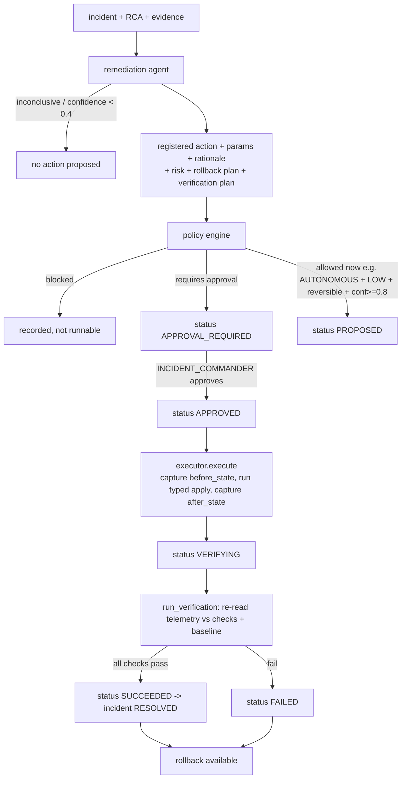

# Remediation

## Core principle

```
AI ──▶ structured tool request ──▶ policy validation ──▶ permission check
   ──▶ risk assessment ──▶ human approval (if required) ──▶ execution ──▶ verification ──▶ rollback?
```

There is **no** path from model output to a shell command. The remediation
agent may only *name* one action from the registry with typed parameters;
`ai/providers._validate_plan` rejects anything else with `ProviderUnavailable`.

## Approval flow



## Policy engine (`remediation/policy.py`)

`evaluate()` returns `allowed_now`, `requires_approval`, `min_role`,
`effective_mode`, and a list of findings (`info` / `warn` / `block`). Checks:

- action is in the allowlist and parameters match its schema (`block` otherwise);
- the `service` parameter resolves (`block` otherwise);
- the incident is still open (`block` if `RESOLVED`/`CLOSED`);
- RCA confidence < 0.5 on a ≥ MEDIUM-risk action → `warn`;
- mode gate: `OBSERVE` blocks everything; `RECOMMEND` is advisory only;
  `APPROVAL_REQUIRED` always needs a human; `AUTONOMOUS` auto-runs only
  `LOW`-risk + reversible + confidence ≥ 0.8;
- any `HIGH`-risk action always needs a human, minimum role
  `INCIDENT_COMMANDER`.

## Action registry (`remediation/registry.py`)

| Action | Params | Default risk | Reversible | Min role |
|---|---|---|---|---|
| `rollback_demo_deployment` | service, to_version, from_version, deployment_ref | MEDIUM | yes | INCIDENT_COMMANDER |
| `scale_demo_service` | service, replicas_delta, connection_pool_delta | LOW | yes | ENGINEER |
| `restart_demo_service` | service, strategy | MEDIUM | no | ENGINEER |
| `disable_demo_feature_flag` | service, flag, reason | LOW | yes | ENGINEER |
| `clear_demo_cache` | service | LOW | no | ENGINEER |

`apply` / `revert` are typed Python functions that mutate demo runtime state on
`Service.attributes["runtime"]` and record a suppressed-fault tag so the demo
telemetry generator ramps the service back toward baseline — which is what lets
verification observe a **real** recovery from stored telemetry rather than a
hard-coded "success".

## Verification (`remediation/verification.py`)

Each check is `{service, metric, agg, op, target, window_seconds}`. A check
passes when the aggregated metric over the recent window satisfies `op target`
**and** (when `compare_to_baseline`) is back within a few sigma / 2× p95 of the
learned baseline. `run_verification` returns `{passed, total, success, checks[]}`.

## Rollback (spec 34)

Every execution stores `before_state`, `after_state`, actor, approval, result
and verification. Reversible actions expose `POST /api/remediations/{ref}/rollback`
(INCIDENT_COMMANDER) which runs the registry's `revert` and records a
`rollback` execution.
